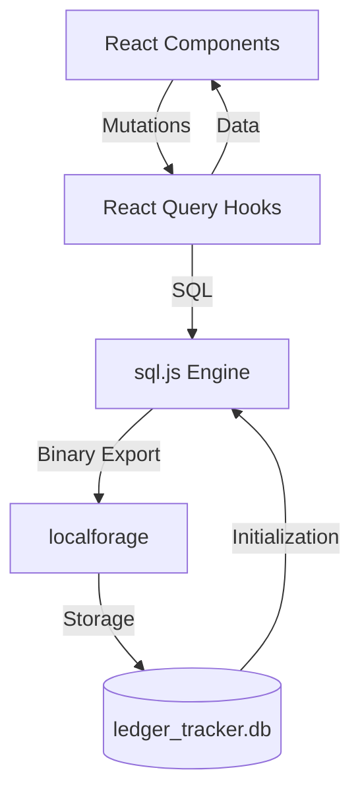
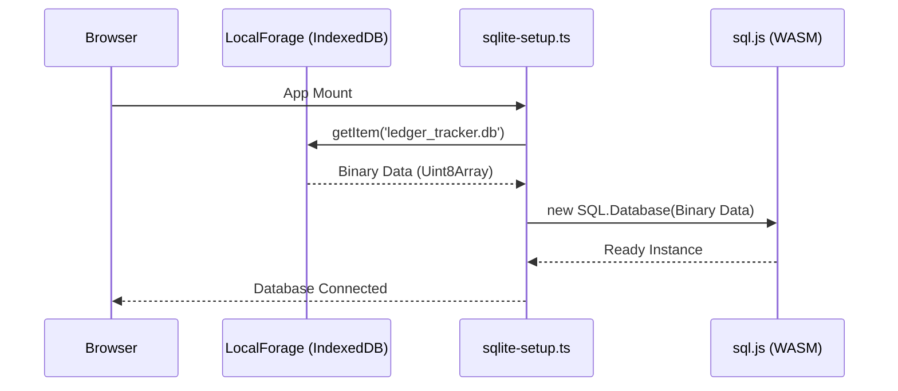
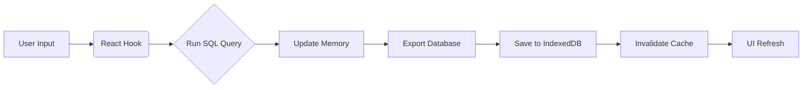

# LedgerTracker: Serverless SQLite Finance Manager

A high-performance expense tracking application built with React, Vite, TypeScript, Tailwind CSS, and Shadcn UI. It uses a serverless backend with sql.js (SQLite in the browser) and persistent storage via localforage.

---

## 🖼️ Application Overview

### 1. Secure Authentication
- **Route**: `/login`
- **Functionality**: Toggle between login and registration. Data is isolated per user using a relational schema.
- **Features**: Glassmorphism UI, smooth transitions, and persistent sessions.

### 2. Financial Dashboard
- **Route**: `/`
- **Functionality**: Centralized overview of balance, income, expenses, and savings rate.
- **Quick Entry**: Fast transaction logging for both income and expenses.

### 3. Transaction Ledger
- **Route**: `/ledger`
- **Functionality**: Complete searchable list of all transactions with filtering and bulk actions.
- **Actions**: Edit, delete, and detailed view for every record.

### 4. Budget Management
- **Route**: `/budgets`
- **Functionality**: Category-specific budget limits with real-time progress visualization.

---

## 🏗️ System Architecture

The application operates entirely on the client-side, using WebAssembly to run a full SQL engine in the browser.



| Component | Technology | Role |
| :--- | :--- | :--- |
| **Framework** | React 18 | UI Layer |
| **Build Tool** | Vite | Bundling & Dev Server |
| **Database** | sql.js | In-browser SQL Engine (WASM) |
| **Persistence** | localforage | IndexedDB wrapper for binary state |
| **State** | TanStack Query | Data fetching & synchronization |
| **UI Library** | Shadcn UI | Component design system |

---

## ⚙️ How It Works: Visual Deep Dive

The application manages data through three distinct phases: **Initialization**, **Operation**, and **Persistence**.

### 1. Initialization Cycle
When the app starts, it restores the database from the browser's storage.



### 2. The Operation & Persistence Loop
Every time you add or edit a transaction, the app ensures the change is saved permanently.



### 3. Data Isolation (Security)
Even though the database is local, it uses a relational structure to ensure user data remains separated.

| Step | Action | Logic |
| :--- | :--- | :--- |
| **1** | **Identify** | Retrieve `user_id` from local session. |
| **2** | **Query** | `SELECT * FROM transactions WHERE user_id = ?` |
| **3** | **Enforce** | SQL constraints prevent unauthorized access to other profiles. |

---

## 🚀 Getting Started

### 1. Installation
```bash
pnpm install
```

### 2. Development
```bash
pnpm dev
```
Access the application at `http://localhost:8080`.

### 3. Production Build
```bash
pnpm build
pnpm start
```

---

## 📂 Project Structure

```text
src/
├── components/
│   ├── auth/           # Auth logic & ProtectedRoute
│   ├── dashboard/      # Stat cards & charts
│   ├── layout/         # Navigation & MainLayout
│   ├── transactions/   # Dialogs & details
│   └── ui/             # Shadcn base components
├── db/
│   ├── index.ts        # Exports & Types
│   └── sqlite-setup.ts # WASM initialization & persistence
├── hooks/              # CRUD hooks (useTransactions)
├── pages/              # App screens (Dashboard, Ledger, etc.)
└── schema.sql          # Relational database documentation
```

---

## 📜 License
This project is licensed under the Apache License 2.0. See the [LICENSE](file:///home/dev/ledger-tracker/LICENSE) file for details.
