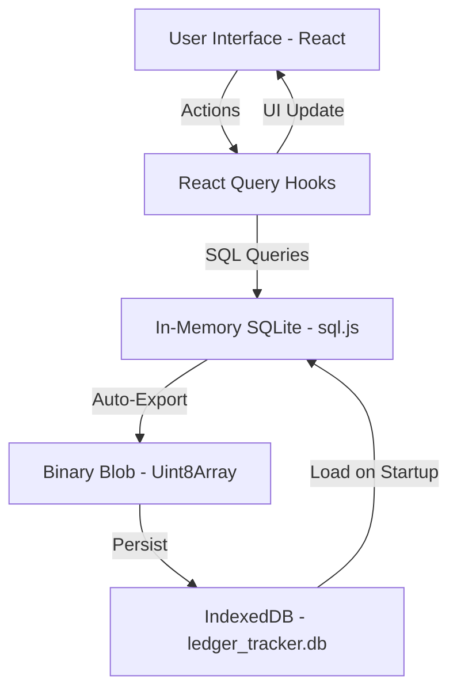

# 💳 LedgerTracker - Premium Serverless SQLite Expense Manager

[](https://reactjs.org/)
[](https://vitejs.dev/)
[](https://sqlite.org/)
[](https://tailwindcss.com/)

LedgerTracker is a state-of-the-art, fully offline-capable expense tracking application. It combines a premium Shadcn UI design with a robust **serverless SQLite** backend, providing users with high-performance data management without the need for a backend server.

---

## 📸 Project Tour

### 1. Secure Authentication
- **Location**: `/login`
- **What it does**: Provides a sleek toggle between Login and Registration. It isolates user data using a relational schema.
- **Visuals**: Vibrant gradients, glassmorphism effects, and smooth transitions.

### 2. Interactive Dashboard
- **Location**: `/`
- **What it does**: Your financial command center. Features real-time stats cards (Balance, Income, Expenses, Savings Rate) and dynamic charts.
- **Quick Entry**: A massive, accessible Plus/Minus interface for instant transaction logging.

### 3. Smart Ledger
- **Location**: `/ledger`
- **What it does**: A powerful data table with filtering, searching, and bulk delete capabilities. Every transaction is just a click away from being edited or viewed in detail.

### 4. Budgeting & Goals
- **Location**: `/budgets`
- **What it does**: Set monthly or weekly limits for specific categories. Progress bars visualize your spending limits in real-time.

---

## 🛠️ Technical Architecture

LedgerTracker uses a unique "Memory-to-IndexedDB" persistence model. Here is how the data flows:



### Core Technologies
- **Frontend**: React 18, TypeScript, Vite.
- **Styling**: Tailwind CSS, Shadcn UI, Framer Motion.
- **Database**: `sql.js` (SQLite compiled to WebAssembly).
- **Persistence**: `localforage` (IndexedDB abstraction).
- **State Management**: `@tanstack/react-query` (Data fetching & caching).

---

## 🚀 Development & Build

### 1. Installation
Ensure you have Node.js (v18+) and `pnpm` installed.
```bash
pnpm install
```

### 2. Development Mode
Starts the Vite dev server with Hot Module Replacement.
```bash
pnpm dev
```
By default, the app will be available at `http://localhost:8080`.

### 3. Production Build
Optimize the application for deployment.
```bash
pnpm build
```

### 4. Production Preview
Run the optimized build locally.
```bash
pnpm start
```

---

## 📂 Features & Functionality

### 🔐 Relational Data Security
- **Isolated Profiles**: Every user has a unique ID. Transactions, budgets, and settings are filtered strictly by the logged-in session.
- **No External Servers**: Your financial data never leaves your device. It stays in your browser's private IndexedDB.

### 📊 Real-time Analytics
- **Dynamic Charts**: Interactive "Spending Trends" (Area Chart) and "Category Breakdown" (Pie Chart).
- **Smart Stats**: Automatic calculation of savings rates and monthly comparisons.

### 📁 Data Portability
- **Export**: Download your entire SQLite database state as a portable JSON file.
- **Import**: Restore your financial history from a backup file instantly.
- **Clear Data**: One-click reset for a fresh start.

---

## 💡 How it Works (Under the Hood)

### The SQLite Engine
The app loads a 600KB WebAssembly file (`sql-wasm.wasm`) into the browser. This file is the entire SQLite engine. We use a custom `getDb()` singleton to ensure only one instance of the database exists at a time.

### Data Persistence
Since `sql.js` is in-memory only, we hook into every database write operation. After a record is inserted or updated, we call `db.export()`, which returns a binary buffer. We save this buffer to IndexedDB under the key `ledger_tracker.db`. On the next visit, we load this buffer back into `sql.js`.

### The SQL Schema
We maintain a full relational schema defined in [schema.sql](file:///home/dev/ledger-tracker/schema.sql). This allows for efficient joins and complex aggregations that wouldn't be possible with simple `localStorage`.

---

## 🤝 Contributing
Forks are welcome! If you'd like to extend the functionality (e.g., adding multi-currency support or custom categories), check out `src/hooks/useTransactions.ts` as the primary entry point for database logic.

---

## 📄 License
This project is open-source and available under the MIT License.
